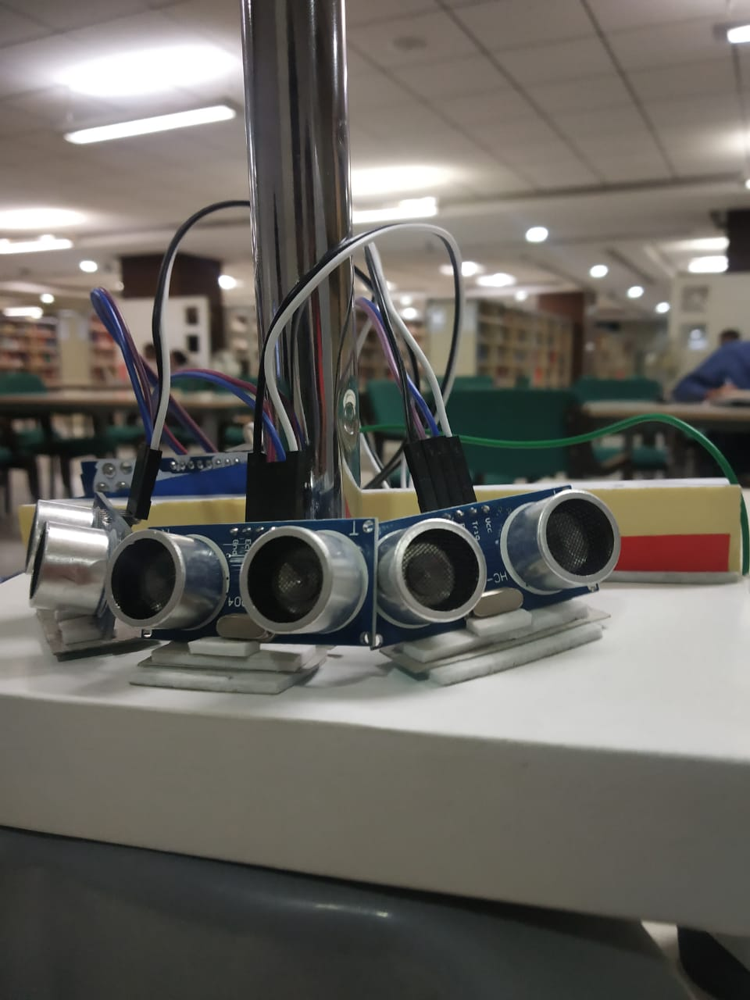
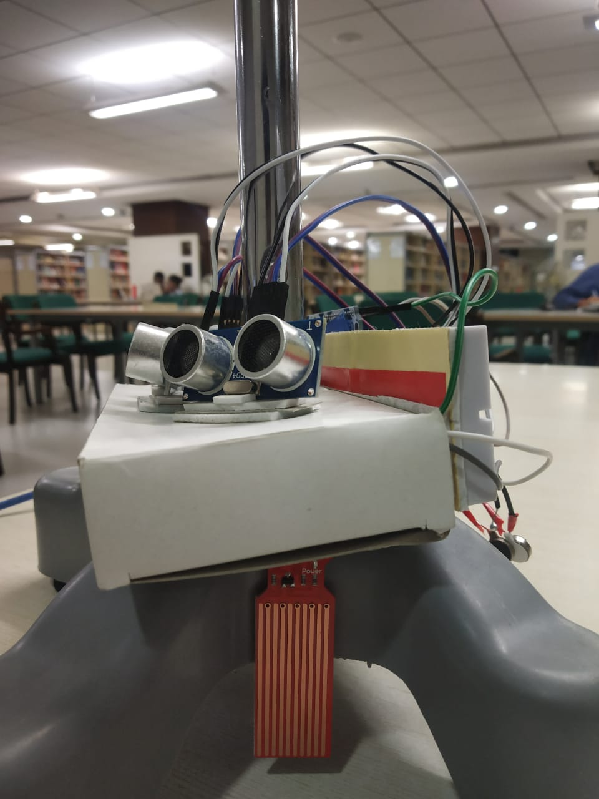

# SmartWalkingCane
A low cost and light weight system with microcontrollers that processes signal and alerts the visually impaired person over any obstacle, water or dark areas through haptic vibrators.

 
